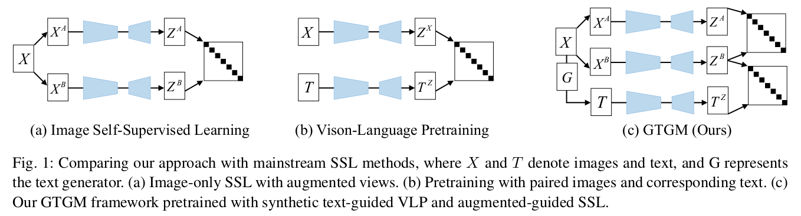
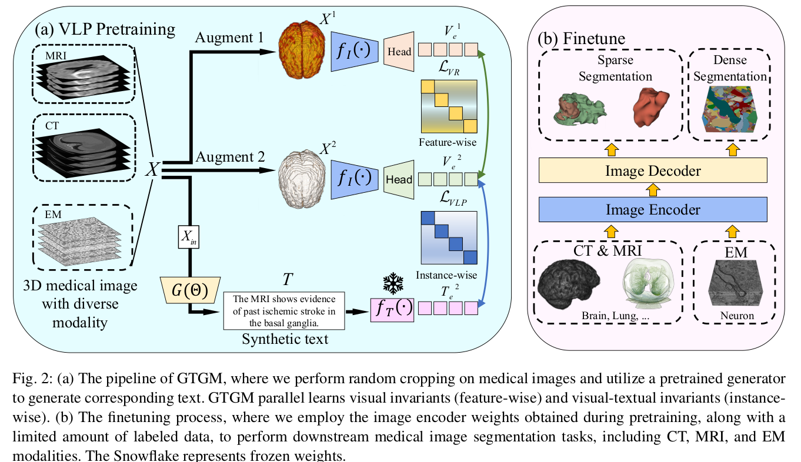

# GTGM
This repository contains the official implementation of the paper **[Generative text-guided 3d vision-language pretraining for unified medical image segmentation](https://arxiv.org/pdf/2306.04811)**. It provides all the experimental settings and source code used in our research. The paper also includes theoretical proofs. For more details, please refer to our original paper.

<div style="text-align: center;">
  
</div>

<div style="text-align: center;">
  
</div>

## Environment Setup

To streamline the setup process, we provide a Docker image that can be used to set up the environment with a single command. The Docker image is available at:

```sh
sudo docker pull registry.cn-hangzhou.aliyuncs.com/mybitahub/large_model:mamba0224_ydchen
```

# To-Do List
- [x] Open-sourced the core code
- [ ] Wrote the README for code usage
- [ ] Open-sourced the pre-training dataset
- [ ] Upload the pre-trained weights


## Cite
If you find this code or dataset useful in your research, please consider citing our paper:
```bibtex
@article{chen2023generative,
  title={Generative text-guided 3d vision-language pretraining for unified medical image segmentation},
  author={Chen, Yinda and Liu, Che and Huang, Wei and Cheng, Sibo and Arcucci, Rossella and Xiong, Zhiwei},
  journal={arXiv preprint arXiv:2306.04811},
  year={2023}
}
```
